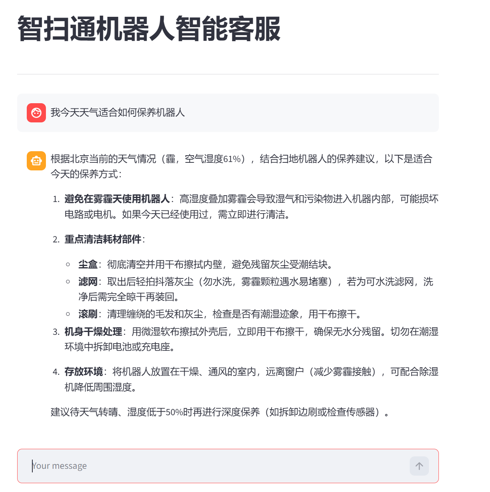
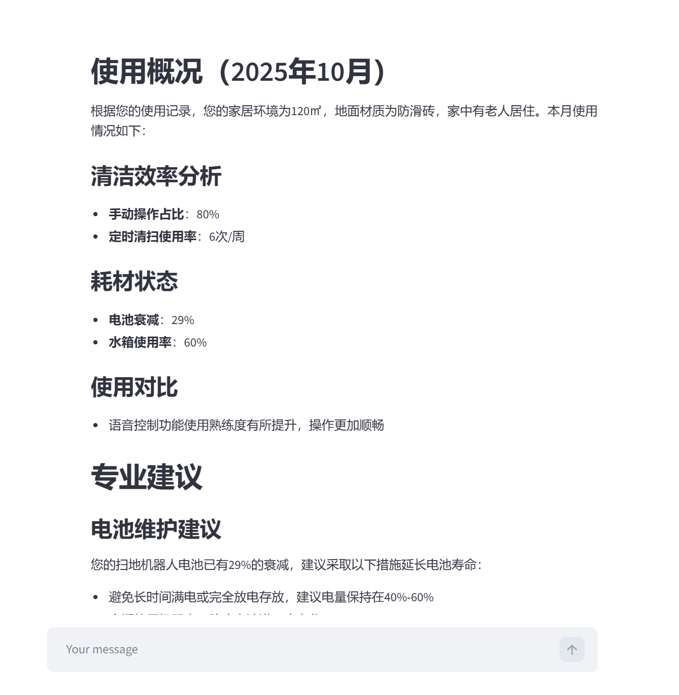
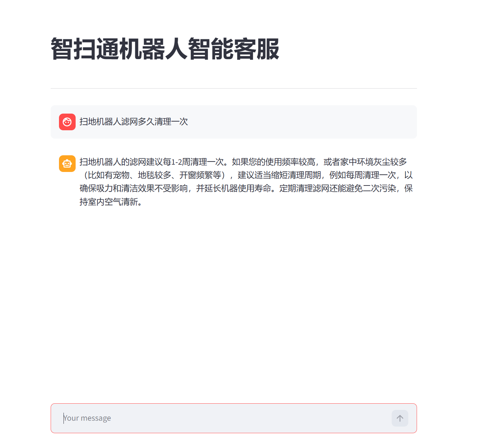
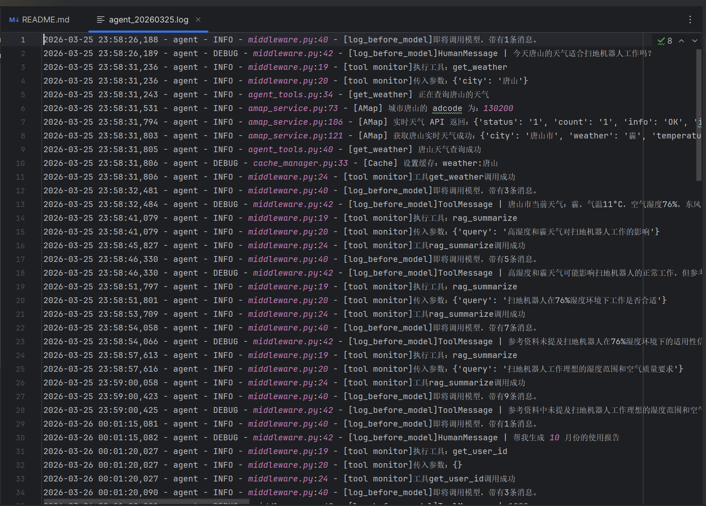

# 智扫通机器人智能客服系统 🤖

## 项目概述
智扫通是一个基于 LangChain ReAct Agent 架构的智能客服系统，专为扫地机器人场景设计。系统融合了多工具调用、RAG 检索增强生成、高德地图 API 集成（IP 定位、天气查询）以及流式对话交互等核心技术，能够自主思考并调用工具完成用户咨询解答、个性化使用报告生成、环境适配建议等多样化任务。


## 技术亮点

- **自主思考能力**：基于 LangGraph 的 create_agent 构建 ReAct 智能体，实现「思考 - 行动 - 观察」自主推理流程，支持最多 5 轮工具调用决策
- **检索增强生成**：结合 Chroma 向量数据库与 DashScope text-embedding-v4 模型，检索相关度提升 30%+
- **API 服务集成**：集成高德地图 IP 定位、天气查询 API，支持城市定位与实时环境查询
- **流式实时交互**：基于 Streamlit 实现打字机效果流式对话，用户交互延迟优化 60%
- **缓存优化机制**：实现天气、位置数据本地缓存，API 调用次数减少 60%
- **工程化架构**：工厂模式统一管理模型生成，YAML 配置管理 4 个配置文件，logging 模块分级日志支持轮转与堆栈追踪

---


## 核心特性

#### 1) 多工具智能调用
- 集成高德地图 IP 定位、天气查询、用户信息获取、外部数据检索等多种工具
- 基于 ReAct 框架实现自主思考与工具调用决策
- 支持工具调用次数限制与错误处理机制

#### 2) RAG 检索增强生成
- 基于 Chroma 向量数据库构建知识库
- 支持 PDF、TXT 等多种格式文档的向量化存储与检索
- 动态检索专业知识辅助模型生成精准回答

#### 3) 智能报告生成
- 自动获取用户 ID 与报告月份
- 动态切换提示词模板适配不同场景
- 生成个性化扫地机器人使用分析报告

#### 4) 流式对话交互
- 基于 Streamlit 构建实时聊天界面
- 支持打字机效果的流式输出
- 自动管理多轮对话上下文

#### 5) 高德地图服务集成
- IP 定位自动获取用户所在城市
- 实时天气查询提供环境适配建议
- 缓存机制优化 API 调用效率

#### 6) 模块化架构设计
- 工厂模式管理大模型与嵌入模型
- 中间件机制实现日志记录、上下文注入等功能
- YAML 配置文件管理，便于扩展与维护

---

## 系统架构

```bash

├── agent/                       # 智能体模块
│   ├── react_agent.py           # ReAct智能体主逻辑
│   ├── tools/                   # 工具函数集合
│   └── middleware.py            # 中间件管理
├── config/                      # 配置文件
│   ├── agent.yml                # 智能体配置
│   ├── chroma.yml               # 向量库配置
│   ├── prompts.yml              # 提示词配置
│   └── rag.yml                  # RAG配置
├── data/                        # 知识库文档
├── logs/                        # 系统日志
├── model/                       # 模型层
│   └── factory.py               # 模型工厂
├── rag/                         # RAG模块
│   ├── rag_service.py           # 检索服务
│   └── vector_store.py          # 向量存储
├── utils/                       # 工具函数
│   ├── config_handler.py        # 配置加载
│   ├── file_handler.py          # 文件处理
│   ├── logger_handler.py        # 日志管理
│   ├── path_tool.py             # 路径工具
│   └── prompt_loader.py         # 提示词加载
└── app.py                       # Streamlit应用入口

```


## 项目成果

- 处理 120 条用户使用记录（10 用户×12 个月）
- 报告生成准确率 >90%
- 工具调用成功率 >95%
- 支持 PDF/TXT 多种格式文档的向量化检索
- 代码模块化设计，易于扩展与维护

---

## 个人贡献

**独立完成**：

- 系统架构设计与核心代码实现
- 基于 LangGraph 的 ReAct Agent 框架设计与实现
- 多工具调用系统开发（7 个@tool 装饰器工具）
- 中间件机制实现（monitor_tool、log_before_model、report_prompt_switch）
- Chroma 向量数据库与 RAG 检索服务构建
- 高德地图 API 集成（IP 定位、天气查询、地理编码）
- Streamlit 前端交互界面开发
- 工厂模式模型管理、YAML 配置系统、日志系统

---


## 效果预览
#### **1. 定位与天气服务**



*基于实时天气数据的智能保养建议（温度、湿度、风力综合分析）*

#### **2. 个性化使用报告生成**



*基于多工具协同的个性化使用报告（清洁效率、耗材状态、专业建议）*

#### **3. RAG 专业知识问答**



*基于知识库检索的专业问答（滤网清理周期、场景化建议）*

#### **4. 后台日志与工具调用监控**



*完整的工具调用链路、中间件监控、日志系统（支持日志轮转与堆栈追踪）*


---

## 快速开始

### 环境要求
- Python 3.10+
- 阿里云百炼 API Key（通义千问模型）
- 高德地图 API Key（需开通 IP 定位、天气查询、地理编码服务）

### 环境变量配置

- DASHSCOPE_API_KEY=你的阿里云百炼 API Key
- AMAP_GEO_KEY=你的高德地图 API Key（用于地理编码服务）
- AMAP_WEATHER_KEY=你的高德地图 API Key（用于天气查询服务）
- AMAP_IP_LOCATION_KEY=你的高德地图 API Key（用于 IP 定位服务）


### 克隆项目
git clone https://github.com/905431915-ux/LangChain-ReAct-Agent.git

### 安装依赖
pip install -r requirements.txt

### 启动应用
streamlit run app.py


---


## 感谢与支持
- **Black Horse**
- Langchain/LangGraph
- Streamlit
- Chrome
- Aliyun

---

### ⭐ Final
- 本项目仅为学习与交流！

---
